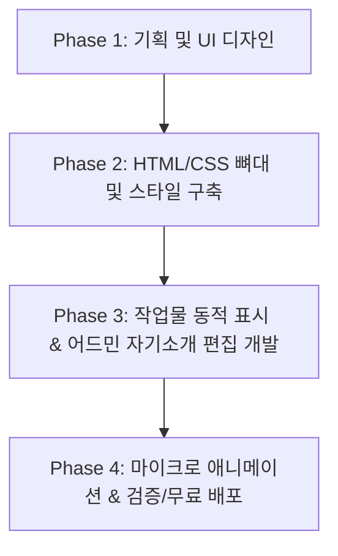

# 🚀 개인 포트폴리오 웹사이트 PRD (Product Requirement Document)

> **문서 버전**: 1.0.0  
> **작성일**: 2026-07-27  
> **작성 목적**: 초보자도 쉽게 이해하고 구현할 수 있도록 개인 포트폴리오 웹사이트의 구조, 화면, 기능 및 개발 단계를 상세히 정의한 문서입니다.

---

## 📌 1. 프로젝트 개요 (Overview)

### 1.1 프로젝트 정의
본 프로젝트는 **'나만의 브랜드와 작업물을 매력적으로 선보이는 반응형 포트폴리오 웹사이트'**입니다.  
방문자(채용 담당자, 클라이언트)에게 시각적으로 세련된 경험을 제공하며, 관리자(본인)는 별도의 복잡한 수정 작업 없이 웹페이지상에서 **자기소개 콘텐츠를 직접 수정 및 관리**할 수 있는 동적 기능을 포함합니다.

### 1.2 핵심 목표 (Goals)
1. **강렬한 첫인상**: 방문 후 3초 이내에 직무, 보유 기술, 대표 작업물을 직관적으로 파악할 수 있는 디자인.
2. **손쉬운 유지보수**: '나만 편집 가능한 자기소개란'을 통해 경력이나 다짐이 바뀔 때마다 간편하게 갱신.
3. **작업물 시각화**: 수행한 프로젝트의 목적, 기술 스택, 실질적인 결과물(라이브 데모 및 소스코드) 제공.
4. **모바일 최적화**: 모바일, 태블릿, 데스크톱 등 모든 디바이스에서 최적의 레이아웃 제공.

---

## 👤 2. 타깃 유저 및 페르소나 (Target Audience)

| 구분 | 주요 방문자 | 주요 관심사 / 니즈 |
|---|---|---|
| **채용 담당자 / 리더** | HR 담당자, 개발/디자인 팀장 | - 이 사람의 핵심 역량과 지원 직무가 맞는가?<br>- 작업물(프로젝트)의 완성도와 사용 기술 스택은 무엇인가?<br>- 연락처와 깃허브(GitHub)/블로그 링크가 잘 갖춰져 있는가? |
| **클라이언트 / 외주 요청자** | 외주 및 협업을 원하는 고객 | - 이전 작업물의 퀄리티와 스타일이 원하는 바와 부합하는가?<br>- 자신에 대한 소개와 연락 창구가 명확한가? |
| **사이트 소유자 (나)** | 포트폴리오 주인 | - 코드를 매번 고치지 않고도 자기소개를 쉽게 바꿀 수 있는가?<br>- 새로운 프로젝트를 깔끔하게 계속 추가할 수 있는가? |

---

## 🎨 3. 화면 구성 및 주요 기능 요구사항 (Key Features)

### 3.1 🏠 히로 섹션 (Hero / Main Banner)
방문자가 웹사이트에 들어왔을 때 가장 먼저 마주하는 메인 상단 공간입니다.

- **기능 요소**:
  - **메인 타이틀**: 직무와 가치관을 담은 한 줄 카피 (예: *"사용자 경험을 아끼고 연결하는 프론트엔드 개발자 ○○○입니다."*)
  - **서브 스킬 태그**: `#HTML/CSS` `#JavaScript` `#React` `#UI/UX`
  - **빠른 실행 버튼 (CTA)**: `[작업물 구경하기]` `[연락하기]` `[이력서 다운로드]`

---

### 3.2 ✏️ 나만 편집 가능한 자기소개란 (Editable About Me Section) - ⭐ 핵심 기능

개발 지식이 없거나 코드를 매번 수정하기 번거로울 때, **웹상에서 관리자 로그인 후 자기소개 텍스트를 직접 수정**하는 기능입니다.

#### [일반 방문자 뷰]
- 세련된 카드 레이아웃에 내 소개글, 핵심 가치관, 주요 이력 정보가 깔끔하게 노출됩니다. (읽기 전용)

#### [관리자(나) 편집 모드]
- **인증 프로세스**:
  1. 페이지 하단 또는 헤더의 `[Admin]` 아이콘 클릭.
  2. 비밀번호 입력 모달 팝업 출현.
  3. 비밀번호 일치 시 관리자 모드 활성화 (편집 아이콘 ✏️ 표시).
- **편집 및 저장**:
  1. `[편집]` 버튼 클릭 시 자기소개 텍스트가 입력 창(Textarea)으로 전환.
  2. 내용을 수정 후 `[저장]` 버튼 클릭.
  3. 데이터가 즉시 갱신되어 화면에 반영 (로컬 저장소 `LocalStorage` 또는 데이터베이스 연동).

---

### 3.3 📂 작업물 페이지 (Projects Showcase) - ⭐ 핵심 기능

본인이 제작한 프로젝트들을 카드 형태로 나열하여 한눈에 파악할 수 있도록 제공합니다.

- **프로젝트 카드 구성 요소**:
  - **대표 이미지/썸네일**: 프로젝트 실행 화면 또는 대표 그래픽 이미지.
  - **프로젝트 제목 & 한 줄 설명**: 프로젝트 목적 및 해결 문제.
  - **사용 기술 배지**: `React`, `CSS Glassmorphism`, `REST API` 등 사용된 기술 표시.
  - **바로가기 링크**: `[Live Demo]` (실제 동작 웹사이트) / `[GitHub]` (소스코드 저장소).
- **상세보기 기능 (Project Detail Modal)**:
  - 프로젝트 카드를 클릭하면 팝업 창이 열리며, **프로젝트 개요, 주요 담당 기능, 트러블슈팅(문제 해결) 경험**을 상세히 보여줍니다.

---

### 3.4 🛠️ 기술 역량 섹션 (Skill Set)
내가 다룰 수 있는 프로그래밍 언어, 프레임워크, 도구를 카테고리별로 정돈하여 보여줍니다.

- **카테고리 분류**:
  - **Frontend**: HTML5, CSS3, JavaScript (ES6+), React
  - **Tools & Environment**: Git, GitHub, VS Code, Figma
- **시각화 요소**: 각 기술 스택별 공식 로고 아이콘 + 간단한 숙련도/설명 툴팁.

---

### 3.5 ✉️ 연락처 및 푸터 섹션 (Contact & Footer) - ⭐ 핵심 기능
방문자가 나에게 손쉽게 이메일 문의를 전송할 수 있도록 안내하는 섹션입니다.

- **구성 요소**:
  - **이메일 주소**: `bin030922@gmail.com` (클릭 시 원클릭 복사 기능 지원)
  - **EmailJS 연동 문의 전송 폼**:
    - **입력 항목**: 보내시는 분 이름 (`from_name`), 회신받으실 이메일 주소 (`email`), 문의 내용 (`message`)
    - **전송 서비스**: EmailJS (`ServiceID: service_vqj2f68`, `TemplateID: template_s0otxbz`, `Public API Key: pPPNP051HTkuP4dbG`)
    - **인터랙션 및 피드백**: 전송 시 버튼 상태 전환 (`전송 중... ⏳` ➔ `메시지 전송 완료! 🚀`), 성공시 알림 및 입력창 자동 초기화 (`reset()`), 실패시 오류 알림
  - **소셜 미디어 및 저장소 링크**: GitHub, LinkedIn, Blog
  - **저작권 표시**: Copyright © 2026. All rights reserved.


---

## 🛠️ 4. 기술 사양 및 데이터 구조 (Technical Specification)

### 4.1 추천 기술 스택 (Tech Stack)
- **Frontend**: HTML5, Vanilla CSS3 (Flexbox/Grid, CSS 변수, Glassmorphism, Micro-animations), JavaScript (Modern ES6+)
- **State & Data**: 브라우저 `LocalStorage` (초보자용 서버리스 동적 데이터 관리)
- **Deployment**: GitHub Pages / Vercel (무료 웹 배포)

### 4.2 초보자를 위한 데이터 구조 예시 (JSON Data Schema)

```json
{
  "profile": {
    "name": "홍길동",
    "role": "프론트엔드 개발자",
    "tagline": "사용자와 기술을 연결하는 개발자입니다.",
    "bio": "안녕하세요! 직관적인 인터페이스와 깔끔한 코드를 지향하는 개발자 홍길동입니다. 매일 조금씩 성장하며 유용한 웹 서비스를 만드는 것에 즐거움을 느낍니다.",
    "skills": ["HTML5", "CSS3", "JavaScript", "React", "Git"]
  },
  "projects": [
    {
      "id": "proj-1",
      "title": "포춘 쿠키 오늘의 명언 앱",
      "summary": "클릭 시 인터랙티브한 애니메이션과 함께 오늘의 명언을 제공하는 웹 앱",
      "thumbnail": "./assets/fortune-cookie.png",
      "tags": ["HTML", "CSS Animation", "JavaScript"],
      "demoUrl": "https://example.com/fortune-cookie",
      "githubUrl": "https://github.com/example/fortune-cookie"
    }
  ]
}
```

---

## 📐 5. 개발 로드맵 (Implementation Roadmap)



| 단계 | 주요 목표 | 상세 작업 내용 |
|---|---|---|
| **Phase 1** | **기획 & 와이어프레임** | - 자기소개 문구 작성 및 작업물 이미지/링크 준비<br>- 컬러 파스텔/다크 모드 컨셉 선정 |
| **Phase 2** | **HTML/CSS UI 구축** | - 웹 접근성 및 의미론적 태그(`semantic tag`) 기반 HTML 구조 작성<br>- Modern CSS로 반응형 레이아웃 및 카드 디자인 제작 |
| **Phase 3** | **JS 기능 및 어드민 구현** | - 작업물 목록 동적 렌더링 (`app.js`)<br>- 비밀번호 검증 모달 및 LocalStorage 자기소개 편집/저장 기능 개발 |
| **Phase 4** | **디테일 완성 및 배포** | - Hover 애니메이션, 다크모드 토글 추가<br>- GitHub Pages 또는 Vercel을 통한 무료 배포 및 최종 검증 |

---

## 📚 6. 초보자를 위한 용어 사전 (Glossary)

- **PRD (Product Requirement Document)**: 제품 요구사항 정의서. 만들고자 하는 서비스나 웹사이트의 목적, 기능, 화면 구조 등을 한눈에 파악할 수 있게 정리한 설명서입니다.
- **반응형 웹 (Responsive Web)**: PC, 태블릿, 스마트폰 등 사용자의 화면 크기에 맞춰 알아서 레이아웃이 예쁘게 변하는 웹사이트 기술.
- **어드민 모드 (Admin Mode)**: 일반 방문자는 볼 수 없는 관리자 전용 편집 화면 및 권한.
- **LocalStorage**: 웹 브라우저 내에 데이터를 저장하는 공간. 별도의 서버나 데이터베이스 없이도 수정한 자기소개 글을 기억할 수 있습니다.
- **Semantic Tag (의미론적 태그)**: `<header>`, `<main>`, `<section>`, `<footer>` 등 태그의 이름만으로도 해당 구역의 역할을 알 수 있게 작성하는 HTML 태그.
