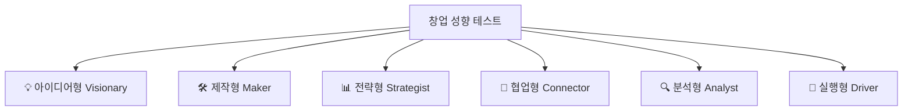
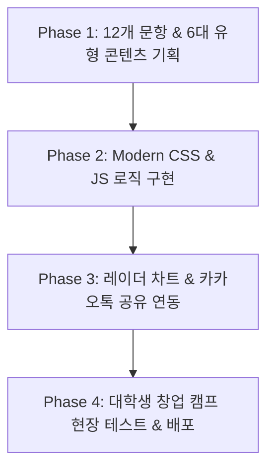

# 🚀 대학생 창업 성향 테스트 웹사이트 PRD (Product Requirement Document)

> **문서 버전**: 1.0.0  
> **작성일**: 2026-07-29  
> **작성자**: 대학생 창업 교육 전문 기획자  
> **프로젝트명**: 대학생 창업 캠프 전용 '나만의 창업 성향 진단 테스트' (Startup Personality Test)

---

## 📌 1. 프로젝트 개요 (Overview)

### 1.1 프로젝트 정의
본 프로젝트는 **'대학생 창업 캠프에 참여한 학생들이 자신의 창업 스타일과 핵심 강점을 쉽고 재미있게 진단할 수 있는 모바일 최적화 웹 서비스'**입니다.  
12가지 창업 상황 질문에 답변하여 **6가지 창업 성향 유형** 중 자신의 스타일을 확인하고, 캠프 현장에서 참가자들 간 **최적의 팀원 궁합**을 찾아 자율적인 팀 빌딩을 성공적으로 수행할 수 있도록 지원합니다.

### 1.2 핵심 목표 (Goals)
1. **빠르고 직관적인 진단**: 12개 상황형 선택지를 통해 2분 이내에 자신의 창업 성향 파악.
2. **캠프 팀 빌딩 활성화**: 결과 페이지에서 '환상의 팀원 조합'을 제안하여 현장 참가자 간 상호 보완적 팀 결성 유도.
3. **바이럴 및 소셜 공유**: 세련된 결과 카드와 원클릭 공유(카카오톡/링크 복사) 기능으로 참가자 간 활발한 결과 소통 유도.
4. **쉬운 유지보수**: 별도 백엔드 서버 없이 프론트엔드 단에서 순수 자바스크립트로 동작하는 가벼운 웹 구조.

---

## 👤 2. 타깃 유저 및 페르소나 (Target Audience)

| 구분 | 주요 사용자 | 주요 관심사 / 니즈 |
|---|---|---|
| **캠프 참가 대학생 (A)** | 창업 아이디어를 가진 참가자 | - 내 아이디어를 함께 실현할 제작자/전략가 팀원을 어디서 찾아야 할까?<br>- 나의 창업가로서의 강점은 무엇일까? |
| **캠프 참가 대학생 (B)** | 개발/디자인 기술을 가진 참가자 | - 나와 잘 맞는 리더나 기획자 유형은 어떤 사람일까?<br>- 팀 프로젝트에서 내가 맡으면 좋은 역할은 무엇일까? |
| **창업 캠프 운영진 / 멘토** | 행사 기획자 및 창업 멘토 | - 참가자들의 성향 비율을 파악하고 치우침 없는 팀 빌딩을 지도하고 싶다.<br>- 아이스브레이킹 요소로 재미있게 활용하고 싶다. |

---

## 🎭 3. 6대 창업 성향 유형 정의 (6 Personality Types)

진단 결과를 통해 정의되는 6가지 핵심 창업가 성향입니다:



1. 💡 **아이디어형 (The Visionary)**: 끊임없이 새로운 아이템과 창의적인 트렌드를 발견하는 창업가.
2. 🛠️ **제작형 (The Maker)**: 아이디어를 눈에 보이는 웹/앱/제품(MVP)으로 빠르게 구현하는 실무 제작자.
3. 📊 **전략형 (The Strategist)**: 비즈니스 모델(BM), 스케일업 및 시장 진입 전략을 치밀하게 설계하는 기획자.
4. 🤝 **협업형 (The Connector)**: 팀원 간의 소통을 도모하고 외부 피드백 및 네트워크를 효과적으로 연결하는 네트워커.
5. 🔍 **분석형 (The Analyst)**: 데이터, 시장 리서치 및 위험 요소를 검증하여 안정적인 성장을 이끄는 리스크 관리자.
6. 🚀 **실행형 (The Driver)**: 목표를 향해 일단 빠르게 행동하고 피드백을 수집하며 추진력을 발휘하는 현장형 실행가.

---

## 🎨 4. 화면 구성 및 주요 기능 요구사항 (Key Features)

### 4.1 🏠 메인 랜딩 화면 (Landing Page)
- **타이틀 & 카피**: *"나는 어떤 창업가일까? 3초 만에 알아보는 나의 창업 성향"*
- **핵심 그래픽**: 6가지 성향 캐릭터 그래픽 뱃지 및 현대적인 다크 슬레이트 & 글래스모피즘 무드.
- **CTA 버튼**: `[내 창업 성향 테스트 시작하기 🚀]`
- **소셜 프로프**: *"현재까지 1,200+명의 대학생이 참여했습니다!"*

---

### 4.2 📝 질문 테스트 화면 (Question Page)
- **진행 방식**: 총 12개 문항 (MBTI 스타일의 2선택지 선택형).
- **인터랙션**:
  - 상단 **프로그레스 바 (Progress Bar)**: 현재 진행 단계 표시 (`1/12` -> `12/12`).
  - 선택지 클릭 시 카드 부유 애니메이션과 함께 **자동 다음 문항 이동**.
  - `[이전 질문으로 돌아가기]` 버튼 제공.

---

### 4.3 📊 상세 진단 리포트 화면 (Result Page) - ⭐ 핵심 기능

#### 1. 대표 유형 카드
- 나에게 맞는 메인 성향 배지 (`💡 아이디어형`, `🛠️ 제작형` 등) 및 대표 한 줄 수식어.
- 캐릭터 프로필 이미지 및 간단한 서머리.

#### 2. 성향 육각형/레이더 차트 (Radar Chart)
- 6가지 성향(아이디어, 제작, 전략, 협업, 분석, 실행)의 분포 점수 비율 시각화.

#### 3. 상세 분석 콘텐츠
- **나의 핵심 강점 (Top Strengths)**: 팀 프로젝트에서 내가 빛나는 3가지 순간.
- **주의할 점 & 보완점 (Blind Spots)**: 내가 놓치기 쉬운 리스크 및 조심해야 할 부분.
- **추천 창업 역할 (Best Fit Role)**: 훌륭한 C-Level 예시 (예: CEO, CTO, COO, CMO 등).

#### 4. 찰떡궁합 팀원 조합 (Team Synergy Guide) - ⭐ 캠프 특화
- **환상의 짝꿍 유형**: 나와 함께 일할 때 시너지가 200% 터지는 추천 성향.
- **상극/주의 유형**: 서열이나 의견 충돌 시 서로 조율이 필요한 성향 및 대화 팁.

#### 5. 공유 및 팀 빌딩 기능
- `[결과 이미지/카드 저장]` 버튼 (인스타그램 스토리 및 캠프 제출용)
- `[카카오톡으로 공유하기]` & `[결과 링크 복사하기]` 버튼
- `[테스트 다시 하기 🔄]`

---

## 🛠️ 5. 데이터 구조 및 알고리즘 사양 (Technical Specification)

### 5.1 문항 및 점수 매핑 구조 예시 (JSON Schema)

```json
{
  "questions": [
    {
      "id": 1,
      "title": "창업 캠프 첫날! 팀원들과 첫 아이디어 회의를 할 때 나는?",
      "options": [
        {
          "text": "세상에 없던 신선하고 파격적인 아이디어를 마구 던진다.",
          "score": { "visionary": 3, "driver": 1 }
        },
        {
          "text": "현재 시장에서 실제로 구동 가능하고 제작할 수 있는지부터 따져본다.",
          "score": { "maker": 2, "analyst": 2 }
        }
      ]
    }
  ]
}
```

### 5.2 결과 산출 로직
1. 12개 문항 응답에 따라 6개 유형별 누적 점수 합산.
2. 가장 높은 점수를 얻은 유형을 **메인 유형(Top 1)**으로 선정.
3. 2위 점수를 얻은 유형을 **서브 유형(Sub Style)**으로 함께 표기 (예: *"아이디어형 (부성향: 실행형)"*).

---

## 📐 6. 개발 및 실행 로드맵 (Implementation Roadmap)



| 단계 | 주요 목표 | 상세 작업 내용 |
|---|---|---|
| **Phase 1** | **콘텐츠 및 질문 기획** | - 12개 상황형 문항 설계 및 6대 유형 텍스트 라이팅<br>- 유형별 강점/보완점/팀원 궁합 매핑 표 완성 |
| **Phase 2** | **프론트엔드 UI 구축** | - 모바일 퍼스트 반응형 레이아웃 작성 (`index.html`, `style.css`)<br>- 질문 상태 변경 및 점수 계산 엔진 개발 (`app.js`) |
| **Phase 3** | **인터랙션 & 공유 기능** | - Chart.js / Canvas 기반 성향 분포 차트 적용<br>- Web Share API 및 카카오톡 공유 SDK 연동 |
| **Phase 4** | **검증 및 무료 배포** | - Vercel / GitHub Pages를 통한 배포 및 창업 캠프 시범 적용 |

---

## 📚 7. 초보자를 위한 용어 사전 (Glossary)

- **PRD (Product Requirement Document)**: 제품 요구사항 정의서. 만들고자 하는 서비스나 웹사이트의 목적, 사용자, 핵심 기능 등을 한눈에 파악할 수 있게 정리한 설계 문서입니다.
- **MVP (Minimum Viable Product)**: 최소 기능 제품. 아이디어를 검증하기 위해 핵심 기능만 담아 빠르게 제작한 초판 제품.
- **레이더 차트 (Radar Chart)**: 여러 항목의 수치를 육각형 등의 다각형 모양으로 시각화하여 균형도를 한눈에 보여주는 그래프.
- **모바일 퍼스트 (Mobile-First)**: 모바일 스마트폰 화면을 최우선 기준으로 디자인하고 개발하는 방식.

---
*본 PRD는 대학생 창업 캠프의 성공적인 팀 빌딩과 참가자 경험 극대화를 위해 기획되었습니다.*
